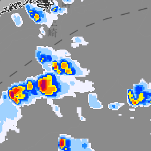
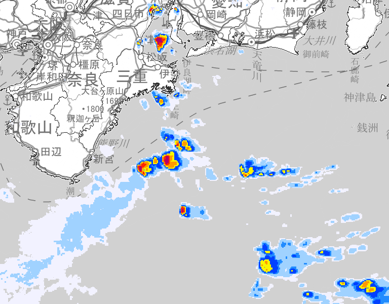

# jma
Download helper for https://www.jma.go.jp/bosai/nowc and https://www.jma.go.jp/bosai/kaikotan, written in Go.

# Usage
```go
package main

import (
	"fmt"
	"github.com/tak0kada/jma"
	"time"
)

func main() {
	now, _ := time.Parse(time.RFC3339, "2021-09-05T13:32:38Z")

	g := jma.GeoCoordinate{33.737131, 137.226929}
	fmt.Printf("GeoCoordinate: %s\n", g) // => GeoCoordinate: {lat: 33.737131, lon:137.226929}

	t := g.ToTile(8)
	fmt.Printf("Tile: %s\n", t) // => Tile: {level: 8, x:225, y: 102}

	err := jma.DownloadImageTile(t, now, 0, "./tile.png")
	if err != nil {
		fmt.Println(err)
	}
	err = jma.DownloadImage(t, jma.Rect{600, 800}, now, 0, "./example.png")
	if err != nil {
		fmt.Println(err)
	}
}
```

## Output
* tile.png



* example.png



# Reference
* [高解像度降水ナウキャスト](https://www.jma.go.jp/bosai/nowc)
* [降水ナウキャスト](https://www.jma.go.jp/bosai/kaikotan)
* [地理院タイル](https://maps.gsi.go.jp/development/ichiran.html)
