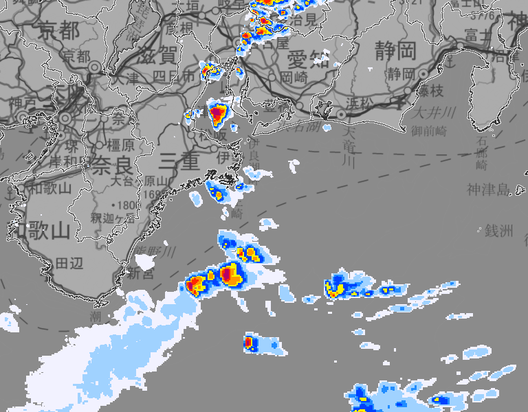

# jma
Download helper for https://www.jma.go.jp/bosai/nowc and https://www.jma.go.jp/bosai/kaikotan, written in Go.

# Usage
```go
package main

import (
	"fmt"
	"github.com/tak0kada/jma"
	"time"
)

func main() {
	now, _ := time.Parse(time.RFC3339, "2021-09-05T13:32:38Z")

	g := jma.GeoCoordinate{33.737131, 137.226929}
	var zoom uint = 8

	if !g.IsValid() {
		fmt.Println("invalid geocoordinate %s. normalizing...")
		g = g.Normalize()
	}
	fmt.Printf("GeoCoordinate: %s\n", g) // => GeoCoordinate: {Lat: 33.737131, Lon: 137.226929}

	t := g.GetTile(zoom)
	fmt.Printf("Tile: %s\n", t) // => Tile: {Level: 8, X: 225, Y: 102}

	err := jma.DownloadImageTile(t, now, 0, "./tile.png")
	if err != nil {
		fmt.Println(err)
	}
	err = jma.DownloadImage(g, zoom, jma.Rect{600, 800}, now, 0, "./example.png")
	if err != nil {
		fmt.Printf(err.Error())
	}
}
```

## Output
* tile.png


* example.png



# Reference
* [高解像度降水ナウキャスト](https://www.jma.go.jp/bosai/nowc)
* [降水ナウキャスト](https://www.jma.go.jp/bosai/kaikotan)
* [地理院タイル](https://maps.gsi.go.jp/development/ichiran.html)
* [タイルマップで緯度経度からタイルを求める](https://standardization.at.webry.info/201401/article_1.html): conversion formula between geocoordinate and tile
