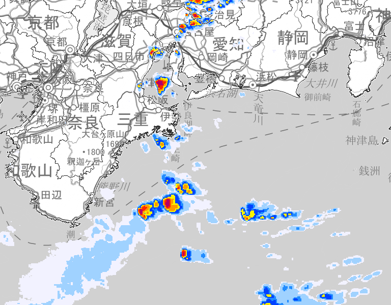

# jma
Download helper for https://www.jma.go.jp/bosai/nowc and https://www.jma.go.jp/bosai/kaikotan, written in Go.

# Usage
```go
package main

import (
	"fmt"
	"github.com/tak0kada/jma"
	"time"
)

func main() {
	now, _ := time.Parse(time.RFC3339, "2021-09-05T13:32:38Z")
	t := jma.Tile{10, 899, 409}
	err = jma.DownloadImage(t, jma.Rect{600, 800}, now, 0, "./example.png")
	if err != nil {
		fmt.Printf(err.Error())
	}
}
```

## Output

